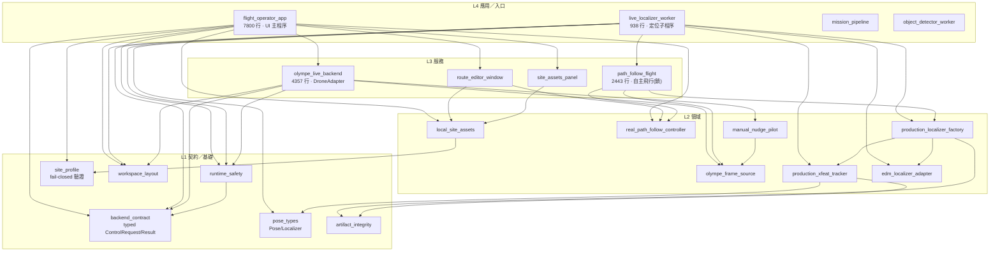
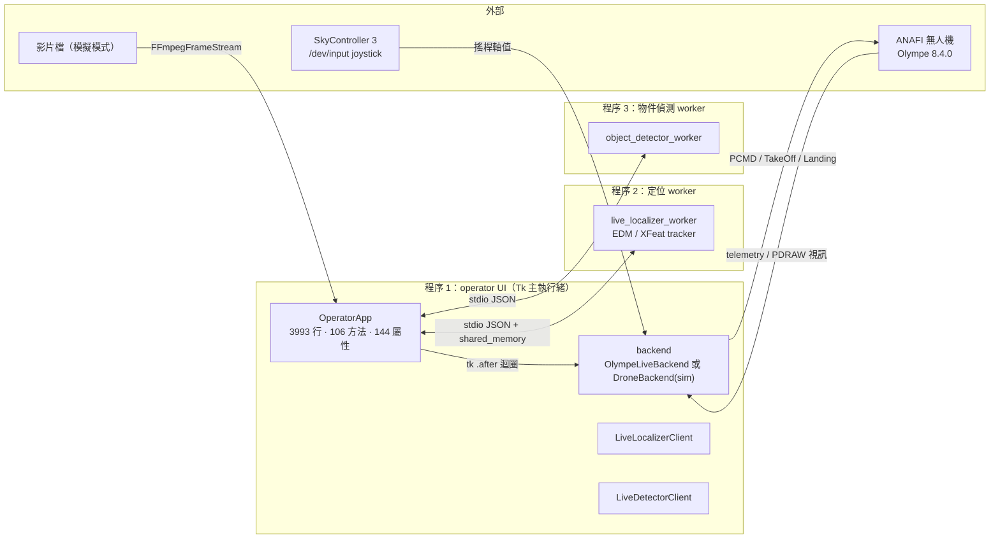
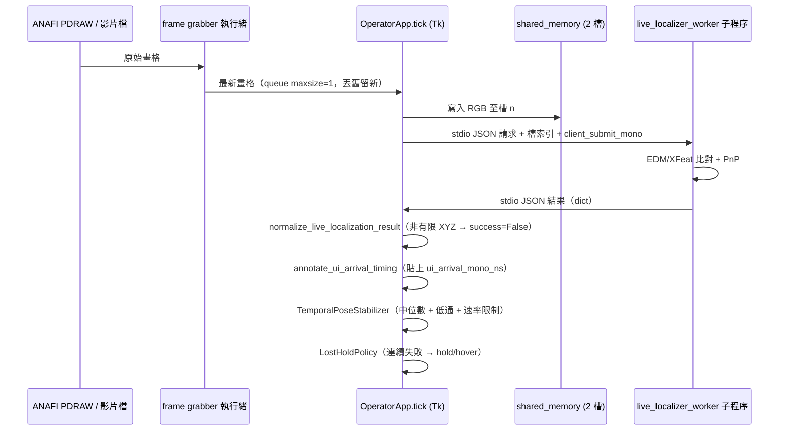
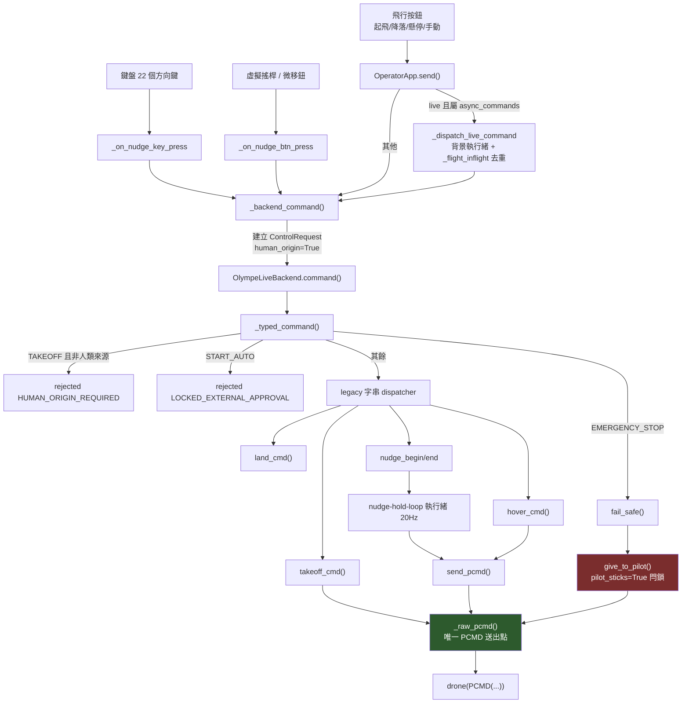
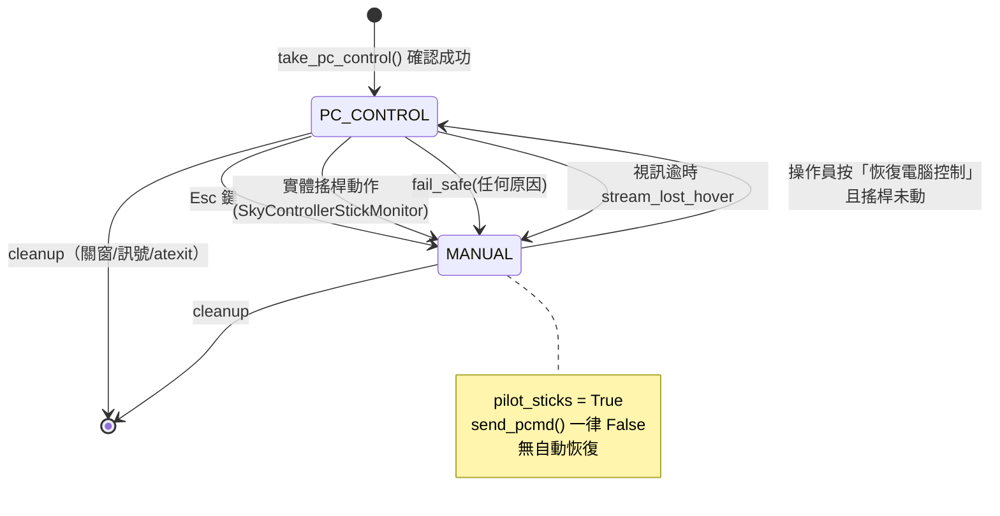
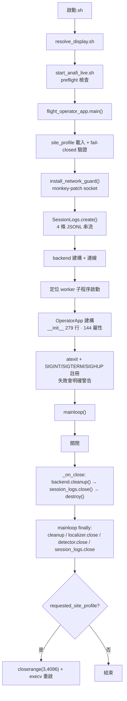
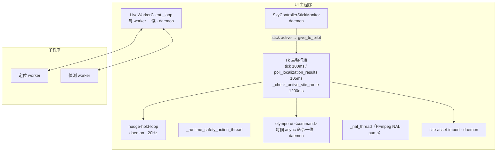
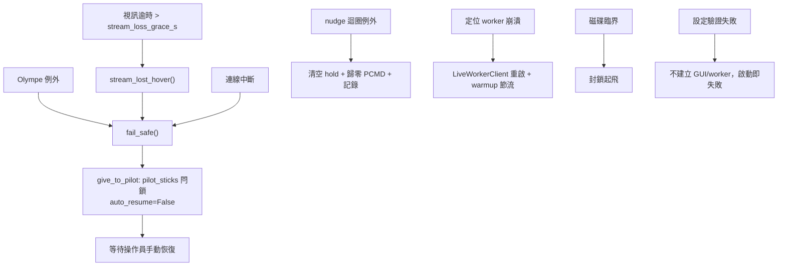

# audit/system_architecture.md — 系統架構、模組依賴與資料流

稽核日期：2026-08-07
基準：`agent/localization-runtime-optimizations` @ `d0b2250`（工作區 dirty，63 檔變更）

本文件所有圖與表皆由**實際程式碼**推導（AST import 圖、`grep` 送出點、實跑 probe），
非由 README 或註解推導。與程式不符之處以程式為準。

---

## 0. 一句話架構

單一 Tk 程序（operator UI）作為 orchestrator，向下透過**注入的 backend 介面**操作
無人機（Olympe）或模擬 backend；定位在**獨立子程序**中執行，以 stdio JSON + shared
memory 與 UI 交換；自主航線飛行目前**硬鎖**，唯一能命令真機的路徑是操作員手動點動。

---

## 1. 模組依賴圖（實測，無環）

以 AST 解析 `控制介面程式/`、`定位演算法/flight_control/`、
`定位演算法/deploy_code/sfm_glomap_deploy/`、`tools/` 內全部非測試 `.py` 得出。

**結果：0 個 circular import。依賴圖是乾淨的 DAG。**

**分層評價**：層次清楚，箭頭一律由上往下。`olympe_live_backend` **不 import**
`flight_operator_app`——`DroneState` 以 `state_factory` callable 注入（`olympe_live_backend.py:642`）。
這是正確的依賴反轉。

**扇入最高的模組**（被依賴次數）：`site_profile` 6、`real_path_follow_controller` 6、
`olympe_frame_source` 6、`workspace_layout` 5、`backend_contract` 5、`pose_types` 5。
這些是事實上的穩定介面層，符合預期。

**唯一結構異味**：`olympe_frame_source -> autoflight`——影像來源模組依賴自主飛行模組，
方向與其他邊相反。屬 P3。

---

## 2. 系統元件圖（程序與行程邊界）

---

## 3. 相機影像 → 定位輸出路徑

**關鍵事實**：
- 畫格 queue `maxsize=1`（`flight_operator_app.py:2059`）——**天然丟舊留新，不會累積 backlog**。
- 定位結果帶有 monotonic 時間戳：`client_submit_mono`、`client_response_mono`、
  `source_frame_stamp_mono`、`frame_callback_enter_mono_ns`、`ui_arrival_mono_ns`。
- 定位結果**是無型別 dict**，非 typed 物件（見 findings F-05）。
- `pose_types.Pose` 是給飛控邊界用的 typed 契約（x/y/z/yaw/stamp，明確標注 raw GLOMAP
  座標、stamp 為 monotonic 永不用 wall clock），但**不用於 UI↔worker 這條路徑**。

---

## 4. UI → 控制命令 → SDK 路徑（含仲裁點）

### 4.1 命令仲裁 — **系統的最大優點**

**PCMD 只有一個實際送出點**：`olympe_live_backend.py:2229 _raw_pcmd()`，其中
`self.drone(PCMD(1, r, p, y, g, 0))` 是全庫唯一一行真正送出 PCMD 的程式。

進入該點只有兩條路：

| 路徑 | 用途 | 閘門 |
|---|---|---|
| `send_pcmd()` (`:2239`) | 一般運動命令 | `self._lock` 下檢查：`_cleanup_done`、`_landed`、`pilot_sticks`、`_maneuver_in_progress`（非零命令時） |
| `_zero_pcmd_or_log()` (`:2200`) | 安全歸零 | 刻意繞過上述閘門——歸零必須永遠送得出去 |

**優先級鏈（實測正確）**：
`fail_safe()` → `give_to_pilot()` → `pilot_sticks = True`（持鎖）+ 歸零 PCMD。
一旦 `pilot_sticks` 為真，`send_pcmd` 對**所有**後續命令回傳 False（`:2243-2246`）。
`auto_resume=False` 明確記錄，不會自動恢復；必須操作員按「恢復電腦控制」。

→ **emergency 確實具有最高優先級，且無法被一般命令覆蓋。**

### 4.2 三套彼此獨立的「模式」詞彙

| 概念 | 欄位 | 取值 | 位置 |
|---|---|---|---|
| 控制權 | `DroneState.mode` | MANUAL / PC_CONTROL / AUTO / CLOSED | UI + backend |
| 定位品質 | `RuntimeState.mode` | TRACK / WEAK_TRACK / LOST | `production_xfeat_tracker.py` |
| 自主飛行授權 | `SafetySwitch.mode` | AUTO / HOVER / MANUAL / LAND / EMERGENCY | `path_follow_flight.py:273` |

三者皆為裸字串、皆無 Enum、無共用型別，且都叫 `.mode`。互不衝突（分屬不同類別），
但命名碰撞使跨模組閱讀困難。見 findings F-08。

---

## 5. 手動接管與緊急停止路徑

**四條獨立的接管觸發**（皆導向同一個 `give_to_pilot()`）：
1. Esc 鍵 → `send("manual")`
2. 實體搖桿移動 → `SkyControllerStickMonitor._on_stick_active`
3. `fail_safe(reason)` → 連線失效／視訊逾時／緊急停止
4. `cleanup()` → 關窗、Ctrl+C、SIGTERM、SIGHUP、atexit

---

## 6. 啟動與關閉流程

**關閉路徑評價：完整且有多重保險。**
- `cleanup()` 自述 idempotent（`:4274`），且被 `_on_close`、`finally`、`atexit`、訊號處理
  多次呼叫皆安全。
- 訊號處理有 `exit_in_progress` Event 防重入。
- **訊號註冊失敗會明確印出警告**（`:7744-7749`）——「關終端機會降落」若不成立，畫面會說。
  這是很好的誠實設計。

---

## 7. 執行緒與程序圖

| 執行緒 | daemon | 停止機制 | 例外處理 |
|---|---|---|---|
| `nudge-hold-loop` | 是 | `_nudge_loop_stop` Event | `try/except/finally`，例外時清空 hold 並歸零 PCMD，記錄 `nudge_loop_error` |
| `SkyControllerStickMonitor` | 是 | `stop()` | 斷線回報 `_on_stick_monitor_disconnect` |
| `olympe-ui-<cmd>` | 是 | 自然結束 | 例外經 `_flight_results` queue 回主執行緒 |
| `LiveWorkerClient._loop` | 是 | `_stop_process()`：terminate→wait 1s→kill→wait | 有重啟 + warmup 節流 |
| `SafetyMonitor`（自主，鎖住） | 是 | `terminated` Event | `_run_loop` 111 行 |

**正面**：`nudge-hold-loop` 的 deadman 計時器放在迴圈**內部**，且迴圈死亡時 `finally`
會清空 hold 並歸零——這正是「執行緒死掉導致最後一筆非零命令持續」的正確解法，
且程式碼註解明確說明了此設計理由（`:3022-3029`）。

---

## 8. 錯誤傳播與恢復流程

**錯誤分類實況**：系統**沒有**統一的例外型別階層。失敗以三種方式混用表達：
布林回傳、`None`、以及例外。`ControlResult` 是唯一結構化的失敗表達，但只覆蓋
typed command 路徑，且該路徑存在遺失布林的缺陷（findings F-01）。

`ruff` 統計：全庫 364 個 `BLE001` blind-except、104 個 `S110` try-except-pass。
安全關鍵檔案的分布：

| 檔案 | BLE001 | S110 |
|---|---|---|
| `olympe_live_backend.py` | 81 | 18 |
| `flight_operator_app.py` | 41 | 12 |
| `path_follow_flight.py` | 37 | 9 |
| `runtime_safety.py` | 4 | 0 |

全庫**無**裸 `except:`。多數 blind-except 位於日誌／telemetry 讀取等非控制路徑，
且多半有記錄；但數量本身使「哪些例外被刻意吞掉」難以審閱。見 findings F-06。

---

## 9. 模組責任表

| 模組 | 責任 | 輸入 | 輸出 | 對外介面 | 生命週期 | 執行緒 | 逾時 | fallback | 責任重疊 |
|---|---|---|---|---|---|---|---|---|---|
| `OperatorApp` | UI 建構、telemetry 輪詢、定位結果處理、地圖/視訊算繪、命令送出、日誌、狀態追蹤 | 鍵鼠、backend state、worker 結果 | Tk 畫面、backend 命令 | `send()`、`_backend_command()` | 程序生命週期 | Tk 主執行緒 + 多條 daemon | worker timeout | — | **嚴重過載：7 種責任於單一 class** |
| `OlympeLiveBackend` | 連線、telemetry、視訊、PCMD、起降閘門、地理圍欄、安全閂鎖、磁羅盤校正、RTH、日誌 | ControlRequest、搖桿、Olympe 事件 | PCMD、TakeOff/Landing、DroneState 更新 | `command(ControlRequest)` | connect→cleanup（idempotent） | 主 + nudge loop + stick monitor | 多處 | 歸零 PCMD | **過載：10 種責任** |
| `backend_contract` | 型別化命令契約 | — | `ControlRequest/Result`、Enum | dataclass + Enum | 無狀態 | — | — | — | 無（乾淨） |
| `runtime_safety` | session 日誌、磁碟保留、離線網路守衛、自主 arming 閘門 | 快照 dict | JSONL、blockers list | 函式 + `SessionLogs` | session | — | — | fail-closed | **名實不符：4 種不相關責任** |
| `site_profile` | 場域設定載入與驗證 | JSON | frozen dataclass | `load()` | 啟動一次 | — | — | **無 fallback（正確）** | 無（乾淨） |
| `live_localizer_worker` | 定位子程序 | stdio JSON + shm 畫格 | stdio JSON 結果 | 程序邊界 | 由 client 管理 | 子程序 | client 端 timeout | 重啟 | 無 |
| `path_follow_flight` | 自主航線飛行（**硬鎖**） | 航線、pose | PCMD | `fly()`（立即 SystemExit） | — | SafetyMonitor 執行緒 | 多處 | hover/land | 過載但目前不執行 |
| `SafetySwitch` | 檔案／鍵盤安全開關 | `/tmp/sfm_drone_safety.cmd`、stdin | AUTO/HOVER/MANUAL/LAND/EMERGENCY | `poll()` | 自主飛行期間 | 呼叫端輪詢 | mtime 比對 | **一律 fail-closed 到 HOVER** | 無 |

---

## 10. 「能否替換實作」評估

| 要替換的東西 | 是否可行 | 證據 |
|---|---|---|
| **定位 provider** | **可以** | `production_localizer_factory.py` + `SFM_LOCALIZER_BACKEND` + `resolve_localizer_backend()`；worker 是獨立程序，介面是 stdio JSON。EDM↔XFeat 已實際共存 |
| **地圖 provider** | **大致可以** | `local_site_assets.LocalSitePackageProvider` + `site_asset_interfaces.py` 有抽象；但 `read_ply_points` / `read_map_points` 直接寫在 UI 檔內（`flight_operator_app.py:2729-2809`），換格式要動 UI |
| **drone adapter** | **可以** | `backend_contract` 定義 typed 介面；模擬 `DroneBackend` 與 `OlympeLiveBackend` 已並存；Olympe import 全部延遲在函式內，模組可在無 Olympe 環境 import（實測通過） |
| **UI** | **困難** | 業務邏輯與 Tk widget 在 `OperatorApp` 內深度交織（144 個實例屬性），無 ViewModel 層 |

---

## 11. 架構總評

**強項（實測確認）**
1. PCMD 單一送出點，閘門集中，emergency 具真正最高優先級且會閂鎖。
2. 依賴圖無環，分層清楚，SDK 以延遲 import 隔離。
3. `backend_contract` 是設計良好的 typed 命令契約（request_id / timestamp / human_origin）。
4. `site_profile` 嚴格 fail-closed 驗證，拒絕未知欄位與非有限數值。
5. 關閉路徑多重保險且 idempotent；訊號註冊失敗會明說。
6. `SafetySwitch` 有 stale-AUTO 拒絕（mtime 早於 run start 即拒）。
7. 鏡像重複檔以 `check_runtime_mirrors.py` 機械化強制一致，且測試會跑。
8. runtime 程式碼無機器特定絕對路徑。

**弱項（實測確認）**
1. 兩個 God object：`OperatorApp`（3993 行/106 方法/144 屬性）、
   `OlympeLiveBackend`（3749 行/93 方法/113 屬性）。
2. 無顯式狀態機：`tracker_state` 有 26 個字串值，散落賦值，無 Enum、無 transition 驗證。
3. legacy dispatcher 遺失布林 → 被拒絕的飛行命令回報成功（連 forensic log 都寫成 accepted）。
4. UI↔worker 的定位 payload 是無型別 dict。
5. 約 50 個 `SFM_*` 環境變數形成繞過 `site_profile` 驗證的第二套設定通道。
6. 364 個 blind-except 使「哪些錯誤被刻意吞掉」難以審閱。
