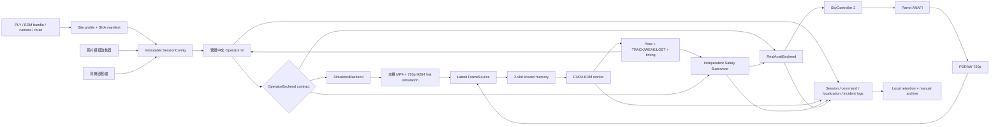
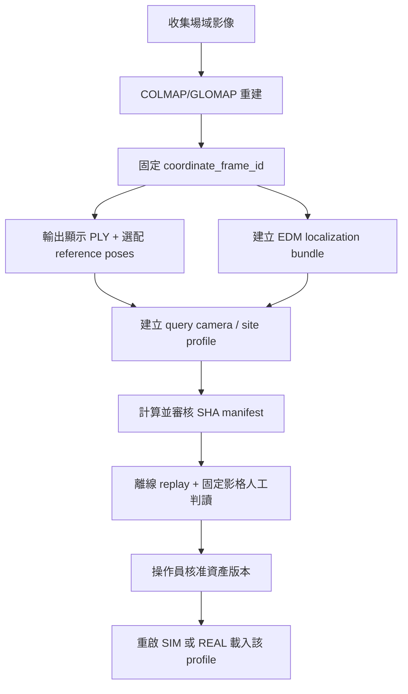
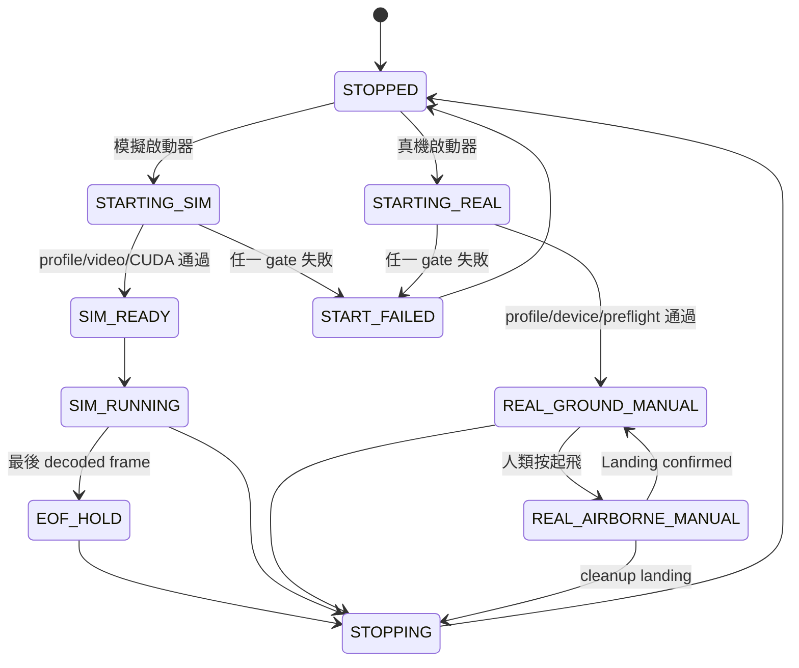
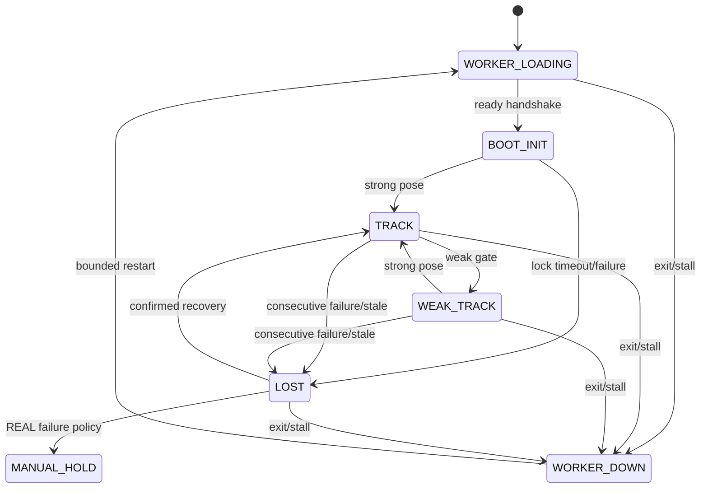
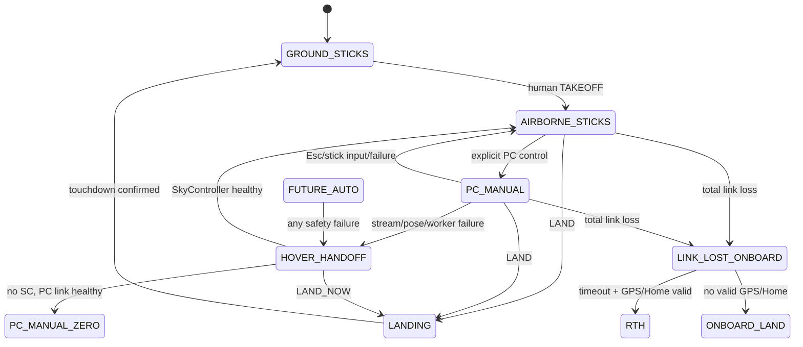

# 場域視覺定位與 Parrot ANAFI 操作系統規格

| 欄位 | 內容 |
|---|---|
| 文件狀態 | 歷史設計與安全決策記錄；現行執行契約以根 README、site profile schema 與 preflight 為準 |
| 規格版本 | 0.2 |
| 日期 | 2026-08-08，Asia/Taipei |
| 適用工作區 | `/home/allen/localization` |
| 規格範圍 | 建圖、定位、控制介面、模擬串流、真機接口、安全、測試、部署、監控 |
| 實作限制 | 本文件保留 To-Be 與當時 As-Is 背景；不得覆蓋現行 fail-closed 程式契約 |

> 2026-08-08 維護註記：第 3 節的 As-Is 原為 2026-08-02 盤點。下列已改成
> 目前實作的關鍵事實；其他分階段與待辦表保留為歷史規劃，不是執行時預設值。

## 1. 決策摘要

本規格採用下列已確認決策，後續實作不得自行改變：

1. 目標優先順序固定為：飛行安全、定位準確、低延遲、失鎖恢復、操作便利、開發效率。
2. 正常操作為單人；未來任何真機自主路徑飛行例外要求兩人確認、實體安全監控員及起飛前 checklist。
3. 系統只有兩個操作接口：`simulated-stream` 與 `real-flight`。保留兩個獨立啟動器，內部共用 Python backend contract；不新增 REST 或 ROS。
4. 接口模式與場域 profile 在程序生命週期內不可變。禁止模擬／真機熱切換，也禁止飛行中或執行中熱換地圖；必須完全關閉後重啟。
5. 模擬接口本階段只保證影片檔。啟動器優先選用工作區內的 P1190119.MP4，否則只有一部匯入影片時自動選用，播放完停在最後一個可解碼畫面，不循環。
6. 模擬介面的起飛、降落、懸停與微移只更新模擬狀態，永不載入 Olympe、連接真機或送出真機命令。
7. 真機接口涵蓋連線與影像、即時定位、人工起飛／降落、人工微移、懸停、手動接管、緊急停止及人類按鈕啟動的自主路徑飛行。自主按鈕先起飛懸停，可靠定位後才移動；定位逾時則原地降落。
8. 地圖及路徑不建立公尺尺度，也不要求 `map_units_per_meter`。地圖座標只作定位、方向、相對路徑進度與畫面顯示。
9. 未來自主路徑的初始實際水平速度上限為 **0.30 m/s**。它是飛機端速度限制，不是 map unit 尺度；必須由真機速度遙測及實機 PCMD 響應測試驗證。速度日後可修改，但只能在確認落地時修改，且每次修改都使原自主飛行核准失效，必須重新測試與核准。
10. 路徑由操作員避開已知障礙物。系統不宣稱具備動態避障或可靠碰撞偵測；稀疏點雲碰撞監控不是正式安全層。每條真機路徑仍須做人工現場淨空審查。
11. 規劃路徑線預設隱藏，操作員可勾選顯示；即時定位軌跡、相機視錐及 XYZ 軸持續顯示。
12. 河濱不是唯一場域。任何具備完整原子化 site profile 的場域都可使用。
13. EDM 河濱 production profile 保留 `max_corr_total=900`。
14. 本次已驗證發布包的正式定位硬體契約是 NVIDIA RTX 5060 + CUDA 12.8，並 fail closed；CPU 只供離線檢查，不可降級成正式飛行定位。其他 GPU 必須重新完成模型、CUDA 與效能驗證後才能另行核准。
15. 系統完全離線運作。模擬模式不可連網；真機模式只允許本機、SkyController／ANAFI 私有網路，不可存取 Internet、DNS 下載模型或執行碼。
16. 主系統維持 Python 3.10；`模擬器/parrot_stimulate` 維持 Python 3.11 獨立環境，但提供一個統一驗證入口。
17. 系統手動啟動，不建立開機或登入自動啟動服務。
18. 高度／距離預設為 30 m／100 m，操作員可在 UI 修改，但只允許在飛機確認落地、連線健康且 firmware readback 可用時套用。
19. 影像、定位或 worker 故障但控制鏈仍在時：立即送零 PCMD、原地懸停、取消自動／電腦連續動作，切換成手動操作。SkyController 搖桿優先；若無 SkyController 但 PC 控制鏈仍健康，保留電腦手動控制。
20. 完全失去飛機控制連線時使用機載安全策略：先懸停／重連；逾時後，GPS 與 Home Point 有效則 RTH，否則依經現場確認的 firmware 策略受控降落。主機端不可假裝斷線後仍能控制飛機。
21. UI 採繁體中文，標準尺寸 1440×900、最低 1180×768；SIM 使用藍色識別，REAL 使用紅橘色永久警告。
22. 定位／效能 log 保留 30 天或總量 20 GB，先到者為準；command／safety／incident log 不自動刪除，只能手動封存或匯出。
23. map、bundle、model、runtime profile 與 SHA manifest 的更新由操作員明確核准。
24. 無 ground truth 時不得宣稱公尺級位置誤差或絕對姿態誤差；以固定影格、全部 LOST 恢復事件及完整軌跡的影像人工判讀作為品質驗收。
25. 最終實作完成後，須由 Claude Opus 5 Max 做獨立全系統審核，再由 Codex 執行經操作員接受的修改。若該模型不可用，不得無聲替換，必須先記錄原因並取得操作員同意。

## 2. 目標、非目標與使用者

### 2.1 目標

- 在任意已建圖場域，以同一套 EDM runtime 進行 720p 影像定位。
- 讓單一操作員可安全使用模擬影片或真機 ANAFI，而不可能誤用另一個接口。
- 真機故障時先停止電腦動作，再交回人工，不沿用過期姿態或過期 PCMD。
- 以可重現的資產 SHA、測試、紀錄與監控，證明修改沒有讓目前定位品質或速度退步。
- 自主飛行採慢速、短有效期、每次依新 pose 重算的控制，初始速度上限 0.30 m/s。

### 2.2 非目標

- 不增加 REST、HTTP 控制 API、ROS topic/service 或執行中接口切換。
- 模擬接口不保證攝影機、RTSP、網路串流或其他來源，只保證本機影片檔。
- 不把稀疏點雲或 YOLO 當作正式碰撞避免系統。
- 不宣稱絕對公尺定位精度、絕對姿態精度或 ground-truth 飛行誤差。
- 不允許 agent、LLM、腳本或其他自動化替操作員按下真機起飛。
- 本階段不核准真機自主路徑飛行。
- 不在執行時下載模型、程式碼、套件或場域資產。

### 2.3 使用者與角色

| 角色 | 正常模式 | 權限與責任 |
|---|---|---|
| 操作員 | SIM、真機人工飛行 | 選場域、啟動接口、人工起降、微移、懸停、修改落地時的 firmware 限制、判讀定位 |
| 安全監控員 | 僅未來自主真機測試 | 全程握有接管能力，執行第二人確認及 checklist；不得由軟體代替 |
| 系統維護者 | 離線 | 建圖、更新 profile／SHA、執行測試與部署；不得自動觸發真機起飛 |
| 獨立審核者 | 發布前 | 審核整個系統、測試證據與未處理風險，不直接操作真機 |

## 3. As-Is：2026-08-02 盤點（關鍵契約已更新至 2026-08-08）

本節描述 2026-08-02 工作區實際狀態，不把後續要求誤寫成已實作功能。

### 3.1 主機與執行環境

| 項目 | 現況 |
|---|---|
| OS | Ubuntu 22.04.5 LTS，Linux 6.8.0-136-generic |
| 主環境 | `/home/allen/localization/.venv`，Python 3.10.12 |
| PCMD 模擬環境 | `模擬器/parrot_stimulate/.venv`，Python 3.11.15 |
| GPU | NVIDIA GeForce RTX 5060 Laptop GPU，8,151 MiB，driver 580.173.02 |
| 正式定位 | EDM PyTorch CUDA FP16；EDM worker 已在 CUDA 不可用時拒絕啟動 |
| 儲存空間 | `/home/allen` 所在檔案系統 140 GB，已使用 91%，只剩約 14 GB |
| 原始碼狀態 | 工作樹有大量既有修改與未追蹤檔案；目前通過測試的狀態尚未形成可重現 release commit/tag |

目前磁碟只剩約 14 GB，因此「最多 20 GB 可自動清理 log」不能單獨作為磁碟安全界線；To-Be 必須另有低磁碟保護。

### 3.2 目前架構

```text
MP4 或 ANAFI PDRAW RGB
        │
        ▼
flight_operator_app.py
        │  兩槽 shared memory，capacity-1/latest-frame
        ▼
live_localizer_worker.py
        ├─ BOOT_INIT / 連續低信心 / LOST：一次性 MegaLoc 全域檢索
        ├─ TRACK / WEAK_TRACK：EDM 局部匹配
        ├─ 2D-3D correspondence
        └─ pycolmap absolute-pose PnP
        │
        ▼
Pose + TRACK / WEAK_TRACK / LOST
        ├─ 桌面 UI
        ├─ JSONL metrics
        └─ 獨立 legacy 路徑控制入口
```

主要所有權如下：

- `控制介面程式/`：site profile、任務入口、桌面 UI、worker protocol、兩個串流 launcher。
- `定位演算法/deploy_code/sfm_glomap_deploy/`：正式 EDM runtime、bundle loader、tracker adapter。
- `定位演算法/flight_control/`：真機路徑控制、安全監控、Olympe 串流與手動工具。
- `定位演算法/validation/`：replay、效能、硬體監控、module ownership 與部署檢查。
- `地圖檔/場域/<site>/`：每個場域的 map、bundle、route、report，不納入 Git。
- `模擬器/parrot_stimulate/`：獨立 Python 3.11 Sphinx／PCMD 響應與路徑安全測試工具，不是第三個操作接口，也不能連真機。

### 3.3 目前兩個接口

| 接口 | 現有入口 | 現況 |
|---|---|---|
| 模擬串流 | `控制介面程式/影片模擬串流/選擇啟動.sh` | 固定 `simulated-stream`，拒絕 real/override 參數，不載入 Olympe；由使用者選擇完整場域 profile/PLY 與影片，CLI launcher 預設 river profile 並只在 P119 或唯一影片時自動選擇；EOF 保留最後一幀且不循環 |
| 真機串流 | `控制介面程式/真機串流/啟動.sh` | 固定 `real-flight`，拒絕 `--video`；明確要求 site profile；透過 SkyController 3 或 direct Wi-Fi 連線，PDRAW 失敗不會退回影片 |

兩個 launcher 已有跨接口參數拒絕測試，並共用 `resolve_display.sh`
探測及驗證本機 X/XWayland `DISPLAY`。

### 3.4 場域與建圖資產

- Site profile 必須綁定 UI 顯示 PLY 與 EDM localization bundle；portable full-runtime
  另要求 `query_camera`。reference poses、route、poles 與場域特調 runtime profile 為選配。
- `river_site_edm.json` 目前為 `flight.approved=false`，route 只供顯示。
- 河濱 route 有 20 個 waypoint，但缺少正式 `sfm-flight-route/v1` 的 `site_id`、`coordinate_frame_id`、`purpose` 等欄位，因此不能通過自主飛行 gate。
- 河濱 profile 的 `flight.coordinate_frame_id` 與 controller 都是 `null`，
  `flight.approved=false`；schema v2 不定義也不要求 `map_units_per_meter`。
- 河濱 EDM runtime profile 中的 `S=1.900843` 是參考相機分布所算出的演算法場景尺度，只用於 `radius`／jump gate；它不是 map-unit-to-metre 比例。現有文字 `scale-calibrated` 容易和公尺尺度混淆。
- 同一 profile 實際有提供的 PLY、bundle、reference poses 與 route
  必須來自同一次重建；不同 SfM 重建不可直接混用。

### 3.5 定位現況

- 正式河濱 backend 為 EDM，輸入 1024×576、PyTorch CUDA FP16、coarse top-k 3225。
- TRACK／WEAK／LOST local top-k 為 1／3／5，BOOT MegaLoc top-k 10，先驗證前 2 張，
  不足才展開；LOST scan=2、grace=12、coarse top-k=3225。
- `max_corr_total=900`，inlier gates 80／50／30，prediction max dt 0.25 s。
- worker 使用兩槽 shared memory、latest-frame coalescing、ready handshake、timeout/restart，避免 UI 累積過期影格。
- EDM runtime 已對 checkpoint、bundle、runtime profile 使用 SHA-256；正式 checkpoint loader 使用 `weights_only=True`。
- 正式 EDM worker 已在 CUDA 不可用時 fail closed。
- `offline_model_smoke.py` 會阻擋 DNS/socket 並驗證本地模型；正式 launcher 尚未在 OS 層限制所有外部連線。

### 3.6 P119 現況基準

| 項目 | 值 |
|---|---:|
| 影片 | 匯入到 `模擬器/測試影片/P1190119.MP4`，或透過 `--video` 明確指定 |
| SHA-256 | `600bbf70227311cab079d77fcb896f97e6d3e55f6bc40b5bef01d74b65f7826c` |
| 容器資料 | H.264 Main，2688×1512，約 23.984 fps，宣告 2,935 幀 |
| 實際可解碼 | 2,934 幀，已確認為已知不完整來源 |
| GPU | RTX 5060 Laptop GPU |
| profile | 河濱 EDM，`max_corr_total=900` |
| 成功 pose | 2,051／2,934，69.9046% |
| 狀態數 | TRACK 2,658；WEAK_TRACK 260；LOST 16 |
| processing FPS | 22.9831 |
| wall p50／p95 | 32.023／77.845 ms |
| inliers p50／p95 | 706／880 |
| reprojection RMS p95 | 2.9355 px |
| limited jump | confirmed 303；unconfirmed 818 |

2026-08-08 使用固定 SHA 原片、河濱 site/localizer profile 與
`validation/baselines/p119_edm_quality.json` 完整重播；品質 gate 通過，且 2,935／2,934
已知不完整例外被明確接受。baseline 的門檻仍保留 2026-08-02 證據值，未因本次結果
放寬。任何不同 SHA 或不同解碼數都必須 fail closed。

最近一次循環 UI 記錄的 TRACK submit-to-UI p95 約 116.05 ms，但它未正確包含 280 ms 模擬鏈路的 capture-before-delay 時間，且來源有循環，所以只作資訊，不作正式端到端門檻。

### 3.7 真機控制與安全現況

已存在的保護包括：

- 只有人類可在桌面 UI 按下「起飛」或「自動飛行」；agent 與自動化禁止起飛。
- SkyController 搖桿偏轉會強制取回控制權。
- Space 懸停、Esc 手動接管、微移按住才送 PCMD、放開或 heartbeat 過期歸零。
- 關窗、Ctrl+C 或 signal 會嘗試零 PCMD、原地降落，再交還 SkyController。
- 高度／距離只有落地時可寫並嘗試 firmware ack/readback；失敗會顯示及記錄警示，但不阻擋起飛。
- 起飛前要求至少 30% 電量；GPS fix 僅作狀態提示，不阻擋手動或自主起飛。
- legacy autonomous runner 有獨立 20 Hz SafetyMonitor、pose freshness、WEAK/LOST、jump、route deviation 與終止安全 gate。
- UI 的「自動飛行」由同一個 Olympe backend 起飛並持續零 PCMD 懸停；連續可靠定位後才交給 production route loop，25 秒仍無定位則原地降落。

尚未符合本規格之處：

- 真機 UI 的 stream stale 會送 hover，但尚未一併交還人工。
- Olympe link loss 目前只記錄並顯示警告 `display_only_no_auto_land`，未完成 B1 lost-link firmware policy 驗證。
- UI localization-only 模式的 worker crash／定位 LOST 尚未形成單一、明確的「零 PCMD後交人工」契約。
- 連線時尚未完整讀取並記錄 aircraft/controller 型號、serial、firmware、連線路徑及 RTH/Home policy。
- 現有 `Emergency` safety mode 與 Space／Esc 分散，UI 尚無明確且醒目的「緊急停止電腦動作」控制。

### 3.8 UI、紀錄、部署與測試現況

- UI 已是 1440×900、最小 1180×768；route 預設隱藏且有「顯示規劃路徑」checkbox。
- 軌跡、相機視錐及 XYZ 軸已顯示。
- SIM 與 REAL 標題不同，但尚未建立完整藍／紅橘視覺身份與永久 REAL 警告區。
- `loc_metrics_*.jsonl`、`live_ui_cmdlog_*.jsonl`、飛行 telemetry 與硬體監控均已存在。
- 已有 session-based durable logging、disk-pressure gate 與 retention manager；
  localization／performance／video metrics 依 30 天或總量 20 GB 清理，command／
  incident／manifest／summary 不自動刪除。`outputs/flight_logs` 目前約 1.1 GB。
- 系統維持手動啟動。
- 已有 `驗證系統.sh` 單一驗證入口；根 Python 3.10 與 `parrot_stimulate` Python
  3.11 維持分離，由入口依序執行。
- 2026-08-08 的維護驗證已加入 Ruff `E9/F`、第一方 coverage `50.00%` 門檻、
  runtime module ownership gate 與獨立 Python 3.11 `parrot_stimulate` CI job。
  P119 全片 replay 通過既有品質門檻；完整測試數與 coverage 以最近一次
  `./驗證系統.sh` receipt 為準，不在規格中硬編一個會過期的測試數。

## 4. To-Be：目標架構



架構約束：

- `SessionConfig.interface_mode`、`site_profile_sha256` 與所有 asset digest 啟動後唯讀。
- 模擬 backend 與真機 backend 實作同一 Python contract，但打包與 dependency 邊界分離。
- `SimulatedBackend` 不可 import Olympe；`RealAnafiBackend` 不可接受 file video source。
- 安全監控不得依賴 Tk UI tick 或定位 worker；UI 卡住或 worker 崩潰時仍可讓既有 PCMD 過期並歸零。
- 正式 production localizer 只有 EDM；XFeat、NeuFlow 與其他候選方法只留在離線研究／比較路徑。
- 只有兩個操作啟動器；建圖、benchmark、Sphinx、驗證工具是維護工具，不是第三個飛行接口。

## 5. 場域、建圖與資產契約

### 5.1 場域 profile

每個場域必須以單一 profile 原子化選取：

- `site_id`、`display_name` 與 `localizer="edm"`。
- schema/selector/UI 必要的顯示 PLY。
- 姿態估計必要的 EDM localization bundle。
- portable full-runtime 必要、且必須對齊影片管線的 query camera。
- 可選的 map reference poses、EDM runtime profile、route／poles 等資產。
- 實際有提供的場域檔案路徑與 SHA-256；飛行 readiness 另依 schema gate。
- `flight.approved=false` 為新場域預設，任何缺漏均 fail closed。

`coordinate_frame_id` 只識別同一次重建，不代表公尺尺度。To-Be schema 不要求 `map_units_per_meter`。

### 5.2 無公尺尺度控制契約

系統將兩種「尺度」明確分開：

- 演算法場景尺度 `S`：由 reference camera 分布計算，只用於定位 radius／jump gate，單位仍是 map unit。
- 公尺地圖尺度：本系統不建立、不要求，也不從相機軌跡猜測。

未來自主路徑控制使用下列方式避免依賴公尺地圖尺度：

1. 用 pose 到下一 waypoint／lookahead 的 map-space 向量決定方向，送出前只取單位方向。
2. 以已校正的 map-to-body 軸向與機體 yaw 將方向轉成 body forward/right，不把 map 距離換成公尺。
3. 實際速度由 ANAFI 的飛機端速度遙測、短 PCMD pulse 與獨立 20 Hz sender 限制；初始 `speed_limit_mps=0.30`。
4. 每筆 autonomous desired PCMD 的有效期不得超過 0.25 s；沒有更新即歸零。
5. 缺少、過期或不可信的飛機速度遙測時，不允許 autonomous translation。
6. waypoint arrival、route deviation、pose jump 等幾何門檻以場域 profile 的 map unit 欄位保存，不能跨場域複製。
7. 速度上限變更只允許落地時操作；變更後 profile/receipt digest 改變，`flight.approved` 自動視為 false。

真機 PCMD 不是直接的 m/s 命令，因此「0.30 m/s」是必須由速度回授保護的上限，不得只以固定 PCMD 百分比推算。真機 response receipt 尚未產生時，自主功能保持鎖定。

### 5.3 建圖與換圖流程



需求：

- 同一 profile 實際有提供的 map、bundle、reference poses、route 不可跨重建混用；
  真機 route 另必須和 `flight.coordinate_frame_id` 一致。
- 新場域第一次只允許模擬／地面定位；`flight.approved` 必須為 false。
- 換地圖只能關閉目前 UI 後，使用另一 profile 重啟。
- profile 或任一資產 SHA 改變後，舊測試及飛行核准全部失效。
- 操作員負責畫出避開已知障礙物的 route；真機使用前仍要在現場逐段確認淨空。
- 系統不得把稀疏點雲空白區解讀成「沒有障礙物」。

### 5.4 Route 顯示與飛行格式

- 顯示 route 可維持目前簡單 `{frame, units, waypoints}` 格式，但必須明確標記 `purpose=display` 或由 profile 標記 display-only。
- 真機自主 route 必須有正式 schema、`site_id`、`coordinate_frame_id`、`purpose=flight`、有限的三維 waypoint、open polyline、SHA-256 與淨空核准。
- UI 預設不畫 route line；checkbox 只改顯示，不改飛行核准或控制狀態。

## 6. 兩個接口規格

### 6.1 模擬串流接口

唯一入口：

```bash
./控制介面程式/影片模擬串流/啟動.sh [影片檔] [UI 額外參數]
```

預設：

| 項目 | 值 |
|---|---|
| interface | `simulated-stream`，唯讀 |
| site profile | `控制介面程式/site_profiles/river_site_edm.json` |
| video | `模擬器/測試影片/` 內的 P1190119.MP4，或單一匯入影片；多部時必須明確指定 |
| output stream | 1280×720、30 fps、H.264 Main、5,000 kbps |
| artificial latency | 280 ms |
| artificial loss | 0% nominal |
| EOF | 保留最後一個完整 decoded frame，狀態 `EOF_HOLD`，不重新開檔、不循環 |
| localization | CUDA EDM，與真機相同的 BOOT/TRACK/WEAK/LOST pipeline |
| controls | 只修改模擬 pose／flight state |

壓力 preset 必須透過同一啟動器提供，不增加新接口：

- `nominal`：280 ms、0%。
- `loss-1`：280 ms、1%。
- `loss-3`：280 ms、3%。
- `loss-5`：280 ms、5%。

百分比代表合成 slice/NAL loss，僅供壓力測試，不宣稱等於某個真實 Wi-Fi 場景。

若預設影片不存在或 SHA 不符，啟動失敗並清楚提示；不可換成其他影片靜默啟動。操作員可明確傳入另一影片覆寫預設。

P119 容器宣告 2,935 幀但只解碼 2,934 幀。對這個固定 SHA，UI 可播放並以 `KNOWN_INCOMPLETE` 標示；完整性 benchmark 必須產生非通過 verdict，除非驗收命令明確使用這項已核准 waiver。任何不同 SHA 或不同可解碼幀數都不是同一份已知例外。

### 6.2 真機接口

唯一入口：

```bash
SFM_SITE_PROFILE=/absolute/path/to/site.json \
  ./控制介面程式/真機串流/啟動.sh
```

正式飛行連線以 Parrot ANAFI 4K + SkyController 3 為目前預期組合。連線後必須從設備讀取並記錄實際值，而不是只相信啟動參數：

- aircraft product/model、serial、hardware revision、firmware version。
- controller product/model、serial、firmware／software version。
- Olympe version、連線 IP／transport、是否經 SkyController。
- PDRAW codec、解析度、fps 與 source timestamp 能力。
- battery、GPS、Home Point、RTH/lost-link policy、firmware 高度／距離設定與允許範圍。

若設備資訊讀不到、型號與核准清單不符或 firmware 尚未測試，仍可在地面顯示診斷，但必須阻止電腦控制起飛與自主功能。

正式飛行一律經 SkyController 3，確保人工搖桿接管。Direct drone Wi-Fi 只屬地面診斷／實驗模式，沒有 SkyController 時不得啟用自主路徑；是否允許人工 PC 起飛仍受獨立現場核准。

真機接口不得接受 `--video`，PDRAW 不可用時不得用影片代替。啟動時必須明確指定 site profile；不得猜河濱或沿用上一次場域。

### 6.3 模式與地圖不可熱切換

- UI 不提供 SIM/REAL toggle。
- backend 建立後不得替換。
- `interface_mode`、site profile path、profile SHA、asset SHA 在 session log 首筆寫入並保持不變。
- 任何切換需求都執行安全關閉、結束 worker、釋放 shared memory，再由另一啟動器建立新 session。

## 7. 共用 Python backend contract

此 contract 是同一程序內的 Python 契約，不是 REST/ROS。實作可使用 `typing.Protocol` 或 ABC，但不得再以未檢查的任意 command string 作唯一契約。

```python
class OperatorBackend(Protocol):
    mode: Literal["simulated-stream", "real-flight"]
    is_live: bool
    state: OperatorState
    video: FrameSource

    def start(self, config: SessionConfig) -> StartResult: ...
    def poll(self, now_mono_ns: int) -> OperatorState: ...
    def command(self, request: ControlRequest) -> ControlResult: ...
    def fail_safe(self, reason: FailureReason) -> ControlResult: ...
    def close(self, reason: str) -> CloseResult: ...

class FrameSource(Protocol):
    def next_frame(self, *, only_new: bool = True) -> FramePacket | None: ...
    def close(self) -> None: ...
```

必要資料：

- `SessionConfig`：session ID、固定 interface、site profile path/SHA、asset SHA、runtime profile SHA、video 或 real endpoint、firmware limits、offline policy。
- `FramePacket`：RGB、sequence、source timestamp、host receipt timestamp、source identity、`eof`、decode／link timing。
- `OperatorState`：connection、stream、localization、flight state、control owner、pose、pose freshness、battery、GPS/Home、limits readback、last command、active incident。
- `ControlRequest`：enum action、typed payload、request ID、host monotonic timestamp、human-origin flag。
- `ControlResult`：accepted、executed、reason code、ack/readback、resulting state、monotonic timestamp。
- `FailureReason`：stream stale、localization WEAK/LOST、pose stale、worker exit/stall、UI heartbeat lost、control link lost、invalid telemetry、disk/log failure、shutdown。

必要 action 與語意：

| Action | SIM | REAL |
|---|---|---|
| `TAKEOFF` | 只改模擬狀態 | 只接受 UI 人類按鍵；執行全部 preflight |
| `LAND` | 模擬落地 | 一次性 Landing，確認結果並記錄 |
| `HOVER` | 模擬速度歸零 | 立即零 PCMD |
| `MANUAL` | 模擬模式切換 | 零 PCMD，優先交還 SkyController；無 SC 時保留 PC 手動但不恢復 AUTO |
| `NUDGE_BEGIN/HEARTBEAT/END` | 改模擬 pose；deadman 相同 | 有限 PCMD，放開／失焦／TTL 到期歸零 |
| `EMERGENCY_STOP` | 清空所有模擬動作並懸停 | 最高優先：取消 pending command、零 PCMD、停止 AUTO／nudge，交人工；不等同空中切斷馬達 |
| `LAND_NOW` | 模擬降落 | 明確且獨立的緊急降落命令 |
| `APPLY_LIMITS` | 更新模擬 HUD | 只在確認落地時寫 firmware，ack/readback 不一致即失敗 |
| `START_LOCALIZATION` | 啟動 worker feed | 啟動 worker feed，不取回 PC 控制、不起飛 |
| `START_AUTO` | 可進入純模擬 route test | 原始 backend typed request 仍回 `LOCKED_EXTERNAL_APPROVAL`；桌面人類 UI 由已驗證路線鎖與整合協調器執行起飛、定位懸停及 route loop |

未知 action、缺 payload、錯誤狀態或 backend 不支援時，必須回傳明確拒絕理由，不可只寫 log 後假裝成功。

## 8. 操作介面規格

### 8.1 版面與身份

- 語言：繁體中文。
- 標準視窗：1440×900；最小：1180×768。
- 兩個尺寸只由 production `UI_STANDARD_SIZE`／`UI_MIN_SIZE` 定義，桌面 app 與
  `--layout-selftest` 必須共用，不得另寫視窗尺寸。
- SIM／REAL 身份以文字區分，不可只靠顏色，避免色覺辨識問題。
- **2026-08-08 介面整理**：恢復常駐頂部狀態列，以獨立文字卡顯示
  REAL／SIM、連線、控制權、飛行狀態、電量、定位與 GPS。身份不再依賴影像幀，
  串流中斷時仍可讀取。每張狀態卡同時使用文字與顏色。
- REAL 仍須顯示 aircraft/controller identity、site ID、control owner 及自主鎖定狀態
  （`控制介面程式/operator_interface` 的 ANAFI／控制權面板）。
- LINK LOST、STREAM LOST、WORKER DOWN、LOGGING FAILED 使用最高優先全寬警告
  （`incident_banner`），且只在事件發生時佔用版面；`安全狀態：正常` 這類閒置列不常駐。
- LOCALIZATION LOST／LOW CONFIDENCE／LOST hold 保留影像內的緊急 banner，
  並同步更新頂部「定位」文字卡。詳細 inliers、reprojection、latency 與影格名稱
  只出現在「診斷／紀錄」，不覆蓋實時影像。

### 8.3 控制與優先權

控制優先順序固定為：

```text
EMERGENCY_STOP / lost-link firmware policy
    > LAND_NOW / cleanup landing
    > MANUAL / stick takeover / HOVER
    > manual nudge
    > future autonomous route
```

- Space 永遠為 HOVER。
- Esc 永遠為 MANUAL／交回搖桿。
- 飛行與 AUTO action button 可進入鍵盤焦點；Return invoke 目前焦點按鈕。
- Space 即使 action button 取得焦點也只執行全方向 HOVER，不 invoke 該按鈕。
- 微移必須 hold-to-move，release／focus loss／heartbeat timeout 都歸零。
- 「開始定位」不能取回 PC control、起飛或啟動 route。
- 「恢復電腦控制」只能進入 PC manual，不能自動恢復 autonomous。
- 發生安全故障後，即使定位恢復也不自動重新進入 autonomous；需要新的人工核准流程。

## 9. 定位系統規格

### 9.1 Production pipeline

```text
BOOT_INIT
  MegaLoc retrieval，一次
  -> EDM batch local matching
  -> 2D-3D correspondence
  -> PnP
  -> TRACK

TRACK
  EDM local_topk=1
  -> WEAK_TRACK 時 topk=3
  -> 連續 2 筆低信心時先懸停／凍幀，再執行一次 MegaLoc recovery
  -> LOST 時 topk=5 + 每個 LOST episode 一次 MegaLoc
```

固定要求：

- MegaLoc 只由三種自動事件觸發：落地狀態的起飛初始化 `BOOT_INIT` 一次、連續 2 筆低信心 EDM 結果後一次，以及每個真正 `LOST` episode 進入時一次。單筆 `WEAK_TRACK` 只提高 EDM top-k；低信心升級前 SIM 凍幀、REAL 歸零 PCMD 並交還人工。正式操作 UI 不得提供手動強制 global retrieval／MegaLoc 的控制。
- 河濱 `max_corr_total=900`。
- 正式 device 必須是 `cuda` 且 GPU identity 符合核准 deployment；CPU fallback 禁止。
- query camera 先驗 schema 與幾何參數；bundle、runtime profile 與 EDM checkpoint
  依各自資產合約驗 SHA-256 和結構後再載入。
- 執行時不得下載 MegaLoc、EDM、XFeat、Hugging Face 或 torch hub 資產。
- shared-memory owner 只由 UI 建立／unlink，worker 只能 attach／detach。
- worker busy 時只保留最新 frame，不排隊重播過期 frame。
- source capture、host receipt、worker start/end、UI arrival 使用 monotonic timestamp 並保留 clock semantics。
- GPU profiling synchronization 預設關閉；開啟 profiling 的 FPS 不可當 production FPS。

### 9.2 安全輸出條件

Pose 只有在下列條件全部通過時才能成為可控制 pose：

- XYZ、rotation、reprojection、timestamp 都有限且 schema 正確。
- source timestamp 未過期。
- inlier、reprojection 與 tracker state 通過 runtime profile。
- jump／trajectory continuity gate 通過，或有第二個一致 fix 確認重定位。
- pose 所屬 site/profile/session 與當前 session 相同。

WEAK、LOST、stale pose 或 worker error 都不可沿用上一筆非零 autonomous command。

### 9.3 無 ground truth 的驗收

- 不輸出「誤差 X 公尺」或「姿態誤差 X 度」的正式 claim。
- 固定抽查影格：0、293、587、880、1174、1467、1760、2054、2347、2641、2933。
- 另外抽查每一個 LOST entry、LOST recovery 及前後各一個成功 frame。
- 產生完整軌跡 overlay、狀態色段、跳點清單與 route-relative 視圖供操作員判讀。
- 操作員只核准「大致位置正確／不正確」、「軌跡連續／不連續」與具體例外，不把人工判讀換算成公尺精度。

## 10. 真機安全需求

### 10.1 起飛前置條件

人工起飛按鈕只有在下列條件全部為真時可用：

- interface 固定為 `real-flight`，site profile 與所有 SHA 已驗證。
- aircraft/controller identity、firmware、Olympe、連線路徑已讀取並記錄。
- ANAFI 羅盤狀態已明確回讀且不是 required／failed／calibrating；經
  SkyController 3 連線時，控制器羅盤也必須明確為 Calibrated。firmware 僅回報
  recommended 時顯示警告但不封鎖人工起飛。
- SkyController 搖桿接管已實測；正式飛行不可只相信設定值。
- battery 至少 30%。
- Home Point 與 firmware lost-link/RTH policy 符合 B1；GPS fix 不是起飛門檻，無可用 Home 時失聯策略必須原地降落。
- 高度 30 m／距離 100 m 或操作員當次設定值已 ack/readback。
- distance geofence 狀態已明確確認：GPS／Home 可用時應開啟；無 GPS 時可關閉或僅提示，且不得把這個狀態當成人工起飛門檻。
- 影像串流、定位 worker、CUDA、logging、磁碟空間健康。
- 真機起飛只能由操作員在本機 UI 實際按下；不得有 CLI、環境變數或自動化旁路。

### 10.2 自主飛行外部核准 gate

所有場域維持 `flight.approved=false`，直到書面／artifact 證據齊全：

1. 同一次 SfM 重建的 coordinate frame 與資產 SHA 綁定確認。
2. 操作員逐段 route 淨空審查。
3. 拆槳 yaw、body-axis、PCMD 正負號與 stick takeover 測試。
4. 在 `landed` 狀態由操作員分別完成 ANAFI 與 SkyController 3 韌體羅盤校正，
   並確認介面能回讀每一軸進度；校正命令不得啟動馬達或移動機體。
5. 真機 PCMD response 測試，證明速度回授與 0.30 m/s 上限可執行；這不是 map scale 校正。
6. 地面測試與低高度、低速測試。
7. 真機 PDRAW + EDM 定位驗證。
8. frame/body 軸向、機體 yaw、camera-to-body yaw offset 校正；不要求 map distance scale。
9. 高度、距離、lost-link、RTH/Home、低電量及 logging fail-closed 測試。
10. `parrot_stimulate` 共用控制器測試、固定 worst-case 測試全部通過。
11. 兩人確認、實體安全監控員及起飛前 checklist 已落實。
12. 操作員明確更新 `flight.approved=true` 並核准新 SHA manifest。

### 10.3 0.30 m/s scale-free 自主控制

- 真機自主 route 實作不得繼續使用目前依賴 `map_units_per_meter` 的 continuous-polyline conversion。
- 正式 route controller 必須和 `parrot_stimulate` 的逐點控制邏輯共用單一實作或單一權威核心，不得維護兩套 PCMD 公式。
- map-space target vector 只提供方向；實際速度只採 airframe telemetry。
- 先轉向、確認穩定、再以短時限 PCMD 平移；每次取得新 pose 後重算。
- 任何速度超過 0.30 m/s、速度未知、pose 過期、WEAK/LOST、route deviation 或 command TTL 過期都立即歸零並進入人工模式。
- 使用者日後可修改速度，但只能落地修改；修改後必須重新做 PCMD response、braking、low-altitude 與 worst-case 測試。

### 10.4 故障策略

| 故障 | 立即動作 | 後續狀態 | 自動恢復 AUTO |
|---|---|---|---|
| 影像 stale／中斷 | 清除 desired PCMD、送零、懸停 | SkyController 手動；無 SC 但 PC link 健康則 PC manual | 否 |
| 定位 WEAK／LOST／pose stale | 同上；停止使用舊 pose | 手動，定位可在背景重抓 | 否 |
| worker exit／stall／OOM | 獨立 safety supervisor 先歸零與交人工，再重啟 worker | 手動 | 否 |
| UI freeze／focus loss | nudge heartbeat/desired PCMD TTL 到期歸零 | 手動或 hover | 否 |
| SkyController stick movement | 立即停止 PC PCMD並交回 sticks | SkyController manual | 否 |
| PC 與 SkyController/aircraft 完全斷線 | 主機停止假設可控；機載懸停／重連 | GPS+Home 有效逾時 RTH；否則經驗證的受控降落 | 否 |
| battery 低於 30% 或核心安全讀回不合格 | 起飛前拒絕；空中依 firmware 與操作員處置 | 手動／安全降落 | 否 |
| GPS／Home／distance geofence／高度或距離限制未就緒 | 文字提示；無 GPS 時 distance geofence 可關閉或僅提示，不阻擋手動起飛；AUTO 先懸停等待定位，逾時原地降落 | 手動可飛／AUTO 等待 | 否 |
| logging 或磁碟無法保證 safety log | 起飛前拒絕；空中發出 incident 並交人工 | 手動 | 否 |
| 關窗／Ctrl+C／SIGTERM | 零 PCMD、停止錄影、原地 Landing、交還 sticks | CLOSED | 不適用 |

### 10.5 緊急停止定義

「緊急停止」指停止電腦／自主移動，不是空中切斷馬達：

- 原子取消所有 pending control request。
- desired PCMD 設為零且鎖存，不因晚到 worker result 恢復。
- 清空所有 nudge hold。
- 切換 SkyController 手動；若只有健康 PC link，留在 PC manual zero state。
- 需要降落時由獨立 `LAND_NOW` 執行。
- 任何 motor emergency／cut-out 功能不放在一般 UI，除非另有硬體製造商程序與外部核准。

## 11. 狀態機

### 11.1 Session／接口狀態



SIM 與 REAL 之間沒有 transition；只能回到 STOPPED 後由另一啟動器重建 session。

### 11.2 定位狀態



SIM 在 LOST 可凍住影片做 bounded recovery；REAL 不可凍 camera，只能懸停並交人工。

### 11.3 控制權狀態



`FUTURE_AUTO` 在本階段不可進入。

## 12. 效能與品質 KPI

### 12.1 不退步原則

- 先固定 input/profile/model/bundle SHA、RTX 5060、driver/power profile、P119、PnP seed 與 benchmark command。
- 品質 gate 使用固定輸入的 deterministic count，不給「效能誤差」掩蓋品質退步。
- 時間／FPS 取三次 warmed full run 的中位數，排除主機更新、thermal throttle 與 profiling mode；中位數不得比基準差。
- 任何基準更新都需要操作員核准新 artifact/SHA，不可由測試自動接受新結果。

### 12.2 正式 gate

| KPI | 基準／要求 | 判定 |
|---|---:|---|
| P119 decoded frames | 固定 SHA 應為 2,934，容器宣告 2,935 | 必須標記 `KNOWN_INCOMPLETE`；其他數量 fail |
| Pose successes | ≥1,686／2,934 | 低於即品質回歸 |
| TRACK count | ≥2,244 | 低於即品質回歸 |
| LOST count | ≤139 | 高於即品質回歸 |
| inliers p50／p95 | ≥693／875 | 任一低於即品質回歸 |
| reprojection RMS p95 | ≤2.9565 px | 高於即品質回歸 |
| processing FPS | ≥11.7024 | 三次 warmed run 中位數 |
| wall p95 | ≤158.126 ms | 三次 warmed run 中位數 |
| LOST inference max | ≤530.750 ms | 不得變慢；每個 episode 必須有 recovery／terminal verdict |
| 正常 TRACK submit-to-UI p95 | 目前資訊值 116.05 ms | 修正 source timestamp 後先封存 B0；之後不得退步 |
| nominal source-to-UI p95 | 尚無可信 B0 | 必須把 280 ms link delay 納入 timestamp，產生 B0 後才能宣稱達標 |
| worker busy queue depth | ≤1 latest frame | 不允許舊 frame backlog |
| safety command observation-to-zero | ≤100 ms | 由獨立 safety log 驗證；不含故障偵測門檻 |
| pose freshness cutoff | ≤500 ms | 過期即不得控制 |
| stream stale cutoff | ≤750 ms | 過期即 hover/manual |
| nudge deadman | ≤250 ms | UI freeze/release 後必須歸零 |

「定位成功率」只表示演算法在該影片成功輸出通過 gate 的 pose，不表示絕對位置正確。正式品質判定還要通過第 9.3 節的人工影像審查。

## 13. 錯誤處理

| 錯誤 | SIM | REAL | Log／UI |
|---|---|---|---|
| profile／asset 不存在 | 拒絕啟動 | 拒絕啟動 | 列出缺少路徑與 site ID |
| SHA mismatch | 拒絕啟動 | 拒絕啟動 | expected/actual，不載入 artifact |
| CUDA 不可用／GPU 不符 | 拒絕 production localization | 不阻擋手動起飛；自主起飛後只懸停並在定位逾時時原地降落 | 顯示 driver/GPU 診斷，不降級 CPU |
| 影片目錄沒影片／多部未指定 | 拒絕啟動 | 不適用 | 提示匯入影片或明確指定 `VIDEO` |
| P119 2,934/2,935 | 播放、標示已知不完整、EOF hold | 不適用 | integrity verdict 非正常完整 |
| 一般影片 decode error | 保留最後完整 frame，進 `DECODE_ERROR_HOLD` | 不適用 | frame index、ffmpeg status |
| PDRAW 無 frame | 不適用 | 零 PCMD、懸停、手動 | 全寬紅色警告與 incident |
| worker 啟動太久 | 保持首幀／不播放 | 地面不得起飛；空中交人工 | ready/error/log path |
| worker stall／exit | bounded restart | 先安全 handoff，再 restart | 每次 restart reason/count |
| 非有限 pose／錯 schema | 當定位失敗 | 當定位失敗並安全 handoff | 原始錯誤不得污染 state |
| control request 不合法 | 明確拒絕 | 明確拒絕 | request ID、reason code |
| firmware write/readback mismatch | 更新模擬狀態失敗 | 拒絕起飛 | desired、bounds、readback |
| log 開檔／寫入失敗 | 顯示警告，可停止模擬 | 起飛前 fail closed；空中交人工 | stderr fallback + incident banner |
| 磁碟低空間 | 清理可刪 log，必要時停止新模擬記錄 | 清理可刪 log；不足以保證 safety log 時拒絕起飛 | free bytes、purged files、blocked reason |

## 14. 紀錄與監控

### 14.1 Session log

每次啟動建立唯一 session directory 或同 session ID 的 JSONL 組：

- `session_manifest.json`：mode、site/profile/assets/model SHA、video SHA 或 hardware identity、Python/package/CUDA/driver、啟動參數、offline policy。
- `commands.jsonl`：request、ack/readback、control owner、實際送出的 PCMD、human-origin、時間戳。
- `localization.jsonl`：frame/source timestamps、state、pose、inliers、reprojection、latency、worker lifecycle。
- `telemetry.jsonl`：battery、GPS/Home、attitude、airframe speed、height/distance、link、firmware limits。
- `incidents.jsonl`：所有 safety transition、失鎖、handoff、lost link、logging/disk failure、shutdown/landing verdict。
- `session_summary.json`：結束原因、最大／p95 指標、事件計數、未確認 landing 或其他未結案項目。

每筆安全相關資料同時保留 UTC wall clock 與 host monotonic ns。不得只靠 UI 文字 log。

### 14.2 保留策略

- localization/performance/video-derived log：30 天或總量 20 GB，先到者為準，按最舊 session 清理。
- command/safety/incident/session manifest/summary：不自動刪除。
- 手動 archive/export 產生 manifest、SHA-256 與檔案清單。
- 自動清理前後都寫 retention audit，不可刪除當前 session。
- `tools/workspace_audit.py` 在 workspace 總量超過 20 GiB 或 filesystem free space 低於 15% 時發出明確 warning；它不自動清理，也不把 warning 誤報成 release 通過。這個 20 GiB workspace 警告與上方 derived-log 的 20 GB retention 配額是不同門檻。
- 真機部署若另有經核准的低磁碟 safety gate（例如 <5 GiB 或 <5%），必須由該部署 gate 實作並寫入 receipt；不得把本 audit 的 warning 當成已完成該 gate，也不可藉由刪除永久 safety log 解決容量問題。

### 14.3 本機監控

完全離線，因此不依賴雲端監控。UI／local monitor 顯示：

- worker ready/restart/stall、CUDA device/memory/OOM。
- stream FPS、frame drop/coalesce、source age。
- TRACK FPS、p50/p95 latency、WEAK/LOST/recovery。
- CPU/GPU temperature、clock、power、thermal slowdown。
- control link、PDRAW、GPS/Home、battery、airframe speed。
- disk free、log write status、retention action。

硬體監控為 read-only，不使用 sudo 取消 thermal protection 或永久修改功耗限制。

## 15. 離線、安全與資產治理

- SIM process 的 outbound network 必須完全禁止，loopback IPC 除外。
- REAL process 只允許 loopback 與已解析的 `192.168.53.1`／`192.168.42.1` 等核准 ANAFI 私有 endpoint；不得查 DNS 或連 Internet。
- 設定 `HF_HUB_OFFLINE=1`、`TRANSFORMERS_OFFLINE=1`、固定 package-local cache；任何 cache 缺失都 fail closed。
- model/checkpoint/bundle/profile/route/reference poses/map manifest 在載入前驗 SHA-256。
- `SparseCloudCollisionMonitor` 目前不是 production safety：runtime lock 沒有 scipy，
  preflight／validation receipt 必須把 clean lock-only effective status 記為
  `unavailable`，並固定 `collision_protection_claim=false`。若產品需求改為依賴此
  monitor，必須先完成 safety wiring 審查、加入受審查的 scipy version 與所有平台
  wheel hashes，再以 `--require-collision-monitor` fail closed；離線時不得猜 hash。
- PyTorch artifact 優先使用 `weights_only=True`、受限 safe globals 及 schema validation。任何仍使用 unrestricted pickle 的維護工具必須先驗 SHA，且不得進 production startup path。
- command log 不記錄 secret；工作區不可要求 Internet token 才能飛行。
- 操作員核准 artifact 更新時，receipt 必須包含舊／新 SHA、變更理由、測試結果、人工視覺判定與日期。
- working tree 未形成 release receipt 前，不得宣稱可重現部署。

## 16. 部署與操作

### 16.1 部署需求

- Ubuntu 22.04 LTS deployment profile。
- RTX 5060 + 已核准 NVIDIA driver/CUDA；啟動時驗證 GPU identity 與 CUDA smoke。
- 主 Python 3.10 environment 維持 UI、EDM、pycolmap、Olympe 相容依賴。
- `parrot_stimulate` Python 3.11 environment 維持獨立，不被 root pytest 跨版本收集。
- 所有依賴、torch hub repo、模型、權重與 firmware test asset 在部署前本地備妥並驗 manifest。
- 不建立 system boot/login service；由操作員手動執行 SIM 或 REAL launcher。

### 16.2 DISPLAY 自動偵測

Launcher 行為：

1. 已存在且可連線的 `WAYLAND_DISPLAY`／`DISPLAY` 優先。
2. 否則檢查目前登入圖形 session，找出可用 X/Wayland display 與對應 runtime/auth。
3. 可驗證地依序探測常見 display，不只硬寫 `:0` 或 `:1`。
4. 找不到可用桌面時清楚失敗，不在背景啟動無人可見的真機 UI。
5. dry-run 顯示選到的 display、Python、mode、profile 與完整安全摘要，但不連接飛機。


## 21. 參考

- `README.md`
- [`ARCHITECTURE.md`](ARCHITECTURE.md)
- `控制介面程式/SAFETY.md`
- `控制介面程式/operator_interface/README.md`
- `控制介面程式/site_profiles/README.md`
- `定位演算法/flight_control/README.md`
- `模擬器/parrot_stimulate/README.md`
- `模擬器/parrot_stimulate/INTEGRATION_REVIEW.md`
- [Parrot ANAFI White Paper v1.4](https://www.parrot.com/assets/s3fs-public/2020-07/white-paper_anafi-v1.4-en.pdf)

---

此版本沒有剩餘的產品訪談問題。Aircraft/controller 實際版本、Home/RTH policy、PCMD response、低高度測試結果與自主核准屬現場執行時產生的驗收證據，不應由文件預先猜測。
